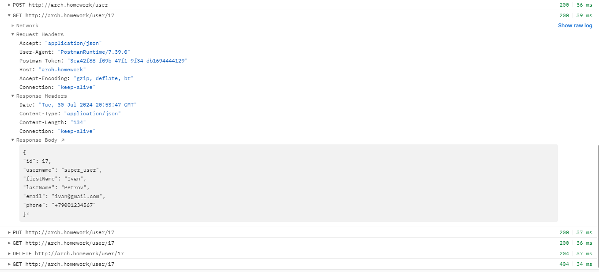
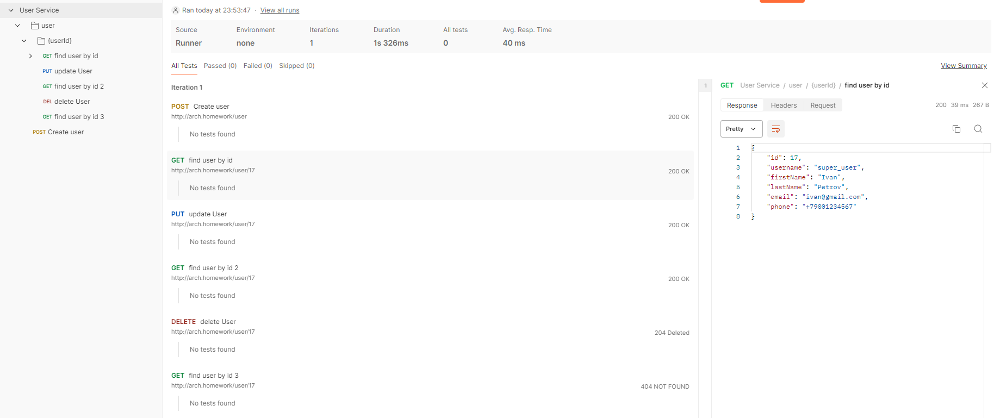

# 15. Работа с Helm-ом

## Написать манифесты для деплоя в k8s для этого сервиса.

Сделать простейший RESTful CRUD по созданию, удалению, просмотру и обновлению пользователей.

Пример API - https://app.swaggerhub.com/apis/otus55/users/1.0.0

Добавить базу данных для приложения.

Конфигурация приложения должна хранится в Configmaps.

Доступы к БД должны храниться в Secrets.

Первоначальные миграции должны быть оформлены в качестве Job-ы, если это требуется.

Ingress-ы должны также вести на url arch.homework/ (как и в прошлом задании)


## На выходе должны быть предоставлена

ссылка на директорию в github, где находится директория с манифестами кубернетеса<BR>
инструкция по запуску приложения.<BR>
команда установки БД из helm, вместе с файлом values.yaml.<BR>
команда применения первоначальных миграций<BR>
команда kubectl apply -f, которая запускает в правильном порядке манифесты кубернетеса<BR>
Postman коллекция, в которой будут представлены примеры запросов к сервису на создание, получение, изменение и удаление пользователя. Важно: в postman коллекции использовать базовый url - arch.homework.<BR>
Проверить корректность работы приложения используя созданную коллекцию newman run коллекция_постман и приложить скриншот/вывод исполнения корректной работы<BR>
<BR>

**Запуск:**
1. Ссылка на чарт: https://github.com/LikerPic/OTUS/tree/master/MSA/15/helm_chart<BR>
2. Копируем чарт себе в каталог `helm_chart`<BR>
3. Создаем инсталляцию
```console
helm install server-crud helm_chart
```

4. Проверяем:
```console
>curl http://arch.homework/user/16
{
"id": 16,
"username": "super_user",
"firstName": "Ivan",
"lastName": "Petrov",
"email": "ivan@gmail.com",
"phone": "+79001234567"
}
```

```diff
+Работает!
```
5. Удаляем инсталляцию
```console
helm uninstall server-crud
```

**Postman**<BR>
2.1. Ссылка на тесты Postman: https://github.com/LikerPic/OTUS/tree/a771a399073b9c99c63183726335e3eed2df546e/MSA/15/Postman<BR>
2.2. Скриншоты с тестами:<BR><BR>

<BR>




