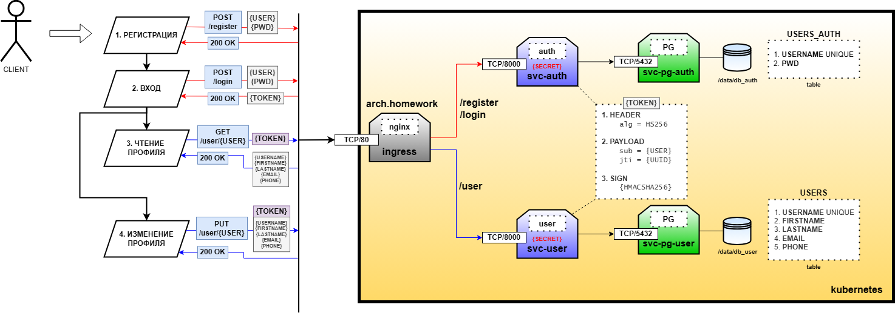

# 21. Backend for frontends. Apigateway

## Написать манифесты для деплоя в k8s для этого сервиса.

Добавить в приложение аутентификацию и регистрацию пользователей.

Реализовать сценарий "Изменение и просмотр данных в профиле клиента".

Пользователь регистрируется. Заходит под собой и по определенному урлу получает данные о своем профиле. Может поменять данные в профиле. Данные профиля для чтения и редактирования не должны быть доступны другим клиентам (аутентифицированным или нет).

## На выходе должны быть

0) описание архитектурного решения и схема взаимодействия сервисов (в виде картинки)

1) команда установки приложения (из helm-а или из манифестов). Обязательно указать в каком namespace нужно устанавливать.

команда установки api-gateway, если он отличен от nginx-ingress.

тесты постмана, которые прогоняют сценарий:

регистрация пользователя 1

проверка, что изменение и получение профиля пользователя недоступно без логина

вход пользователя 1

изменение профиля пользователя 1

проверка, что профиль поменялся

выход* (если есть)

регистрация пользователя 2

вход пользователя 2

проверка, что пользователь2 не имеет доступа на чтение и редактирование профиля пользователя1.


**Запуск:**
1. Ссылка на чарт: https://github.com/LikerPic/OTUS/tree/master/MSA/21/helm_auth<BR>
2. Копируем чарт себе в каталог `helm_auth`<BR>
3. Создаем инсталляцию
```console
helm install solution-auth helm_auth
```

4. Проверяем:
Windows Terminal:
```console
1.
curl -v -d "{\"user\":\"jack\",\"pwd\":\"f6e248ea994f3e342f61141b8b8e3ede86d4de53257abc8d06ae07a1da73fb39\"}"  http://arch.homework/register
>> 200 OK

2.
curl -v -d "{\"user\":\"jack\",\"pwd\":\"f6e248ea994f3e342f61141b8b8e3ede86d4de53257abc8d06ae07a1da73fb39\"}" http://arch.homework/login
>> 200 OK
{"token" : "eyAgImFsZyI6ICJIUzI1NiJ9.eyAic3ViIjogImphY2siLCAianRpIjogIjAyMDk3MDc4LTY0NjktZThmNC02NDk5LTk1YjVlN2VlOWY4MCJ9.xJJ-Il5n2DvgjnUG0nBO7v0_zGqfNWCf8Inm1J5t1o8"}

3.
curl -v -d "{\"user\":\"jack\",\"pwd\":\"16e248ea994f3e342f61141b8b8e3ede86d4de53257abc8d06ae07a1da73fb38\"}" http://arch.homework/login
>> 403 FORBIDDEN

USER:
4. 
curl -v http://localhost:8001/user/jack
>>> 403 TOKEN ERROR

5. Проверка подписи (правильный запрос)
curl -v -H "Authorization: eyAgImFsZyI6ICJIUzI1NiJ9.eyAic3ViIjogImphY2siLCAianRpIjogIjU5N2MxNzY3LTM0OTEtYTMwZC04NzgzLTc5ZDQ3ZmZkODY5OSJ9.i1vRKE7yV8yGRxDmwhCE6UXMFB6fAfH_coUULwKs0Bg" http://arch.homework/user/jack
>>> 200 OK
{
"username": "jack",
"firstName": "",
"lastName": "",
"email": "",
"phone": ""
}

6. Проверка подписи (испорченный запрос)
curl -v -H "Authorization: AyAgImFsZyI6ICJIUzI1NiJ9.eyAic3ViIjogImphY2siLCAianRpIjogIjU5N2MxNzY3LTM0OTEtYTMwZC04NzgzLTc5ZDQ3ZmZkODY5OSJ9.i1vRKE7yV8yGRxDmwhCE6UXMFB6fAfH_coUULwKs0Bg" http://arch.homework/user/jack
>>403 TOKEN ERROR

7. Проверка подписи (правильная подпись, но неправильный пользователь в запросе)
curl -v -H "Authorization: eyAgImFsZyI6ICJIUzI1NiJ9.eyAic3ViIjogImphY2siLCAianRpIjogIjU5N2MxNzY3LTM0OTEtYTMwZC04NzgzLTc5ZDQ3ZmZkODY5OSJ9.i1vRKE7yV8yGRxDmwhCE6UXMFB6fAfH_coUULwKs0Bg" http://arch.homework/user/john
>>403 TOKEN ERROR


8. Обновление: кривой запрос
curl -v -X PUT -d "{\"firstName\":\"realJack\",\"lastName\":\"Cooper\"}" -H "Authorization: eyAgImFsZyI6ICJIUzI1NiJ9.eyAic3ViIjogImphY2siLCAianRpIjogIjU5N2MxNzY3LTM0OTEtYTMwZC04NzgzLTc5ZDQ3ZmZkODY5OSJ9.i1vRKE7yV8yGRxDmwhCE6UXMFB6fAfH_coUULwKs0Bg"  http://arch.homework/user/jack2
>>403 TOKEN ERROR

9. Обновление: новый пользователь
curl -v -X PUT -d "{\"firstName\":\"realJack\",\"lastName\":\"Cooper\"}" -H "Authorization: eyAgImFsZyI6ICJIUzI1NiJ9.eyAic3ViIjogImphY2siLCAianRpIjogIjU5N2MxNzY3LTM0OTEtYTMwZC04NzgzLTc5ZDQ3ZmZkODY5OSJ9.i1vRKE7yV8yGRxDmwhCE6UXMFB6fAfH_coUULwKs0Bg"  http://arch.homework/user/jack
>>OK

9.1. Проверка:
curl -v -H "Authorization: eyAgImFsZyI6ICJIUzI1NiJ9.eyAic3ViIjogImphY2siLCAianRpIjogIjU5N2MxNzY3LTM0OTEtYTMwZC04NzgzLTc5ZDQ3ZmZkODY5OSJ9.i1vRKE7yV8yGRxDmwhCE6UXMFB6fAfH_coUULwKs0Bg" http://arch.homework/user/jack
>>OK
{
"username": "jack",
"firstName": "realJack",
"lastName": "Cooper",
"email": "",
"phone": ""
}


10. Обновление: существующий пользователь - обновление поля
curl -v -X PUT -d "{\"firstName\":\"realJack\",\"lastName\":\"Cooper222\"}" -H "Authorization: eyAgImFsZyI6ICJIUzI1NiJ9.eyAic3ViIjogImphY2siLCAianRpIjogIjU5N2MxNzY3LTM0OTEtYTMwZC04NzgzLTc5ZDQ3ZmZkODY5OSJ9.i1vRKE7yV8yGRxDmwhCE6UXMFB6fAfH_coUULwKs0Bg"  http://arch.homework/user/jack
>>OK

10.1. Проверка:
curl -v -H "Authorization: eyAgImFsZyI6ICJIUzI1NiJ9.eyAic3ViIjogImphY2siLCAianRpIjogIjU5N2MxNzY3LTM0OTEtYTMwZC04NzgzLTc5ZDQ3ZmZkODY5OSJ9.i1vRKE7yV8yGRxDmwhCE6UXMFB6fAfH_coUULwKs0Bg" http://arch.homework/user/jack
>>OK
{
"username": "jack",
"firstName": "realJack",
"lastName": "Cooper222",
"email": "",
"phone": ""
}


11. Обновление: существующий пользователь - добавление поля
curl -v -X PUT -d "{\"firstName\":\"realJack\",\"lastName\":\"Cooper123\",\"email\":\"test@gmail.com\"}" -H "Authorization: eyAgImFsZyI6ICJIUzI1NiJ9.eyAic3ViIjogImphY2siLCAianRpIjogIjU5N2MxNzY3LTM0OTEtYTMwZC04NzgzLTc5ZDQ3ZmZkODY5OSJ9.i1vRKE7yV8yGRxDmwhCE6UXMFB6fAfH_coUULwKs0Bg"  http://arch.homework/user/jack
>>OK

11.1 Проверка:
curl -v -H "Authorization: eyAgImFsZyI6ICJIUzI1NiJ9.eyAic3ViIjogImphY2siLCAianRpIjogIjU5N2MxNzY3LTM0OTEtYTMwZC04NzgzLTc5ZDQ3ZmZkODY5OSJ9.i1vRKE7yV8yGRxDmwhCE6UXMFB6fAfH_coUULwKs0Bg" http://arch.homework/user/jack
>>OK
{
"username": "jack",
"firstName": "realJack",
"lastName": "Cooper123",
"email": "test@gmail.com",
"phone": ""
}
```


```diff
+Работает!
```
5. Удаляем инсталляцию
```console
helm uninstall server-crud
```

**Postman**<BR>
2.1. Ссылка на тесты Postman: <BR>
2.2. Скриншоты с тестами:<BR><BR>





