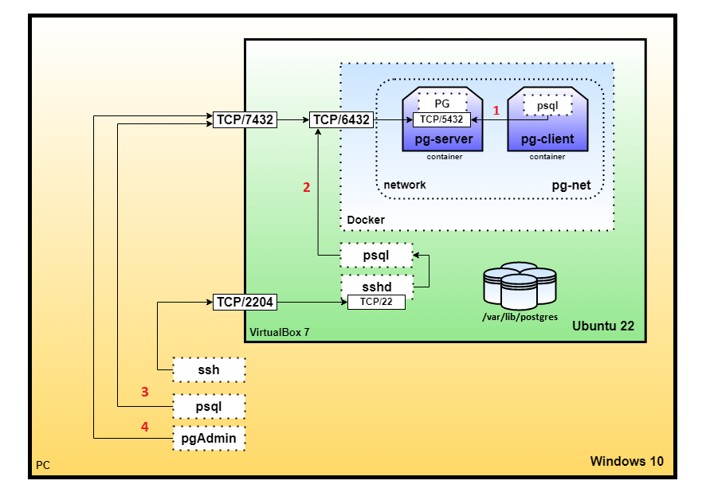
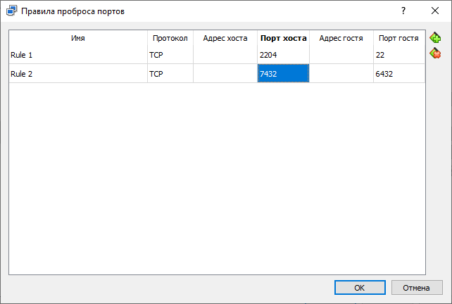
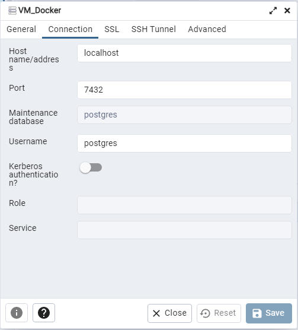
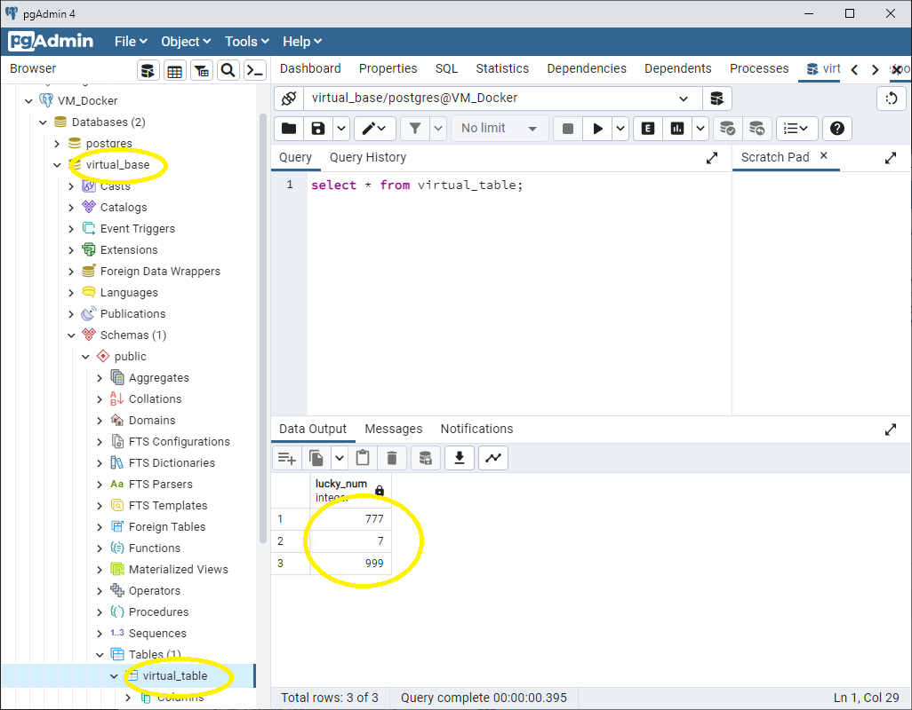

# 03. Установка PostgreSQL

## сделать ВМ с Ubuntu 20.04 и поставить на нем Docker Engine или развернуть докер любым удобным способом
```diff
+Имеем VM VirtualBox с Ubuntu 22.04
```
```console
vboxuser@Ubuntu22:~$ lsb_release -a
No LSB modules are available.
Distributor ID: Ubuntu
Description:    Ubuntu 22.04.1 LTS
Release:        22.04
Codename:       jammy
```
```diff
+Накатываем актуальную сборку Docker Engine
```
Ссылки на установку Docker:
- [link1](https://www.digitalocean.com/community/tutorials/how-to-install-and-use-docker-on-ubuntu-20-04-ru)
- [link2](https://docs.docker.com/engine/install/ubuntu/)
```diff
+Имеем Docker 23.0.0
```
```console
vboxuser@Ubuntu22:~$ docker version
Client: Docker Engine - Community
 Version:           23.0.0
 API version:       1.42
 Go version:        go1.19.5
 Git commit:        e92dd87
 Built:             Wed Feb  1 17:49:08 2023
 OS/Arch:           linux/amd64
 Context:           default
```

## сделать каталог `/var/lib/postgres`
Каталог создали, но какие права на него раздать? (_этот и последующие вопросы не пояснялись не вебинаре_) PG работает от пользователя postgres, но его не должно быть видно хостовой системе из-за докера. Видимо, в каталог должен получить доступ пользователь docker. В общем, дадим доступ на всех =)
```console
vboxuser@Ubuntu22:/var/lib$ sudo mkdir postgres
vboxuser@Ubuntu22:/var/lib$ ls -ld /var/lib/postgres
drwxr-xr-x 2 root root 4096 Feb 10 19:18 /var/lib/postgres
vboxuser@Ubuntu22:/var/lib$ sudo chmod o+w /var/lib/postgres
vboxuser@Ubuntu22:/var/lib$ ls -ld /var/lib/postgres
drwxr-xrwx 2 root root 4096 Feb 10 19:18 /var/lib/postgres
```
## развернуть контейнер с PostgreSQL 14 смонтировав в него `/var/lib/postgres`
Забегая вперед, мы знаем, что нас попросят подключиться из клиентского контейнера в серверный, поэтому надо предусмотреть следующее:
1.	Общую сеть для контейнеров – назовем её `pg-net`;
2.	Контейнер сервера – назовем его `pg-server`;
3.	Контейнер клиента – назовем его `pg-client`.
Изобразим топологию сети для понимания происходящего:


создадим сеть `pg-net`:
```console
vboxuser@Ubuntu22:~$ sudo docker network create pg-net
d0704248c617c3abafc36e9461ecb1fb1dfff1b7329f62a04fd3ac0410c04b27
vboxuser@Ubuntu22:~$  docker network ls
NETWORK ID     NAME      DRIVER    SCOPE
3309138f4099   bridge    bridge    local
9c5dd5833278   host      host      local
a097d7d3b7ca   none      null      local
d0704248c617   pg-net    bridge    local
```
Сеть создали, только как обращаться к хостам этой сети? 
В [мануале](https://docs.docker.com/engine/reference/commandline/run/#network) написано:
>>The default bridge network only allow containers to communicate with each other using internal IP addresses. User-created bridge networks provide DNS resolution between containers using container names.

Выходит, имя хоста совпадает с именем контейнера.

Запустим контейнер с сервером `pg-server`. Наружу выставим порт 6432 чтобы не пересекаться с кластером на хостовой системе и чтобы далее четко понимать куда конкретно мы коннектимся.
```console
docker run --name pg-server --network pg-net -e POSTGRES_PASSWORD=postgres -d -p 6432:5432 -v /var/lib/postgres:/var/lib/postgresql/data postgres:14
vboxuser@Ubuntu22:~$ docker ps
CONTAINER ID   IMAGE         COMMAND                  CREATED          STATUS          PORTS                                       NAMES
00259314057c   postgres:14   "docker-entrypoint.s…"   18 seconds ago   Up 17 seconds   0.0.0.0:6432->5432/tcp, :::6432->5432/tcp   pg-server
vboxuser@Ubuntu22:~$ netstat -na|grep 6432
tcp        0      0 0.0.0.0:6432            0.0.0.0:*               LISTEN
```
Контейнер запустился, порт слушает.
Что всё это за магические параметры при запуске контейнера? Лезем в мануал…
| Параметр | Описание |
| ------ | ------ |
| `--name`|        Assign a name to the container|
|`--env` , `-e`|     Set environment variables|
|`--detach` , `-d`| Run container in background and print container ID|
|`--publish` , `-p`| Publish a container’s port(s) to the host. Формат: <порт хостовой ОС>:<порт внутри контейнера>|
|`--volume` , `-v` |Bind mount a volume. формат: <путь хостовой ОС>:<путь в контейнере>|
|`--network` |	Connect a container to a network|
|`--rm`| 		Automatically remove the container when it exits|
|`--tty` , `-t`|	Allocate a pseudo-TTY|
|`--interactive` , `-i`|	Keep STDIN open even if not attached|

Передача переменной окружения POSTGRES_PASSWORD является обязательным для запуска контейнера. [Пруф](https://github.com/docker-library/docs/blob/master/postgres/README.md).
А почему внутренний путь базы `/var/lib/postgresql/data`? Какой-то нестандартный путь... Согласно мануалу просто именно туда смотрит кластер в контейнере.


## развернуть контейнер с клиентом postgres
запустим клиента PG с подключением к сети `pg-net` и сразу подключимся к хосту `pg-server`:
```console
vboxuser@Ubuntu22:~$ sudo docker run -it --rm --network pg-net --name pg-client postgres:14 psql -h pg-server -U postgres
[sudo] password for vboxuser:
Password for user postgres:
psql (14.6 (Debian 14.6-1.pgdg110+1))
Type "help" for help.
```
Клиент подключился без указания порта, а значит подключился по внетреннему порту `5432`.

## подключится из контейнера с клиентом к контейнеру с сервером и сделать таблицу с парой строк
```console
postgres=# create database virtual_base;
CREATE DATABASE
postgres=# \c virtual_base
You are now connected to database "virtual_base" as user "postgres".
virtual_base=# create table virtual_table (lucky_num int);
CREATE TABLE
virtual_base=# insert into virtual_table values (777);
INSERT 0 1
virtual_base=# insert into virtual_table values (007);
INSERT 0 1
virtual_base=# insert into virtual_table values (999);
INSERT 0 1
virtual_base=# select * from virtual_table;
 lucky_num
-----------
       777
         7
       999
(3 rows)
```
Заглянем в хранилище:
```console
vboxuser@Ubuntu22:~$ cd /var/lib/postgres
-bash: cd: /var/lib/postgres: Permission denied
vboxuser@Ubuntu22:~$ ls -ld /var/lib/postgres
drwx------ 19 vboxadd root 4096 Feb 10 19:57 /var/lib/postgres
```
Доступа на каталог оказывается, нет. Ладно, отложим этот вопрос.

## подключится к контейнеру с сервером с ноутбука/компьютера вне инстансов ВМ
Итак, на схеме мы обозначили следующие способы подключения к серверу `pg-server`:
1. Из другого контейнера (уже сделано на предыдущем шаге)
2. Используем psql из Ubuntu
3. Используем psql из Windows
4. Используем pgAdmin из Windows

`2. Используем psql из Ubuntu`

Запустим штатный ssh-клиент из windows для подключения к ВМ:
```console
C:\Users>ssh vboxuser@localhost -p 2204
vboxuser@localhost's password:
Welcome to Ubuntu 22.04.1 LTS (GNU/Linux 5.15.0-58-generic x86_64)
```

Теперь запустим psql в Ubuntu и подключимся к контейнеру через внешний порт 6432. Данные на месте:
```console
vboxuser@Ubuntu22:~$ psql -h localhost -p 6432 -U postgres
Password for user postgres:
psql (15.1 (Ubuntu 15.1-1.pgdg22.04+1), server 14.6 (Debian 14.6-1.pgdg110+1))
Type "help" for help.

postgres=# \l
                                                  List of databases
     Name     |  Owner   | Encoding |  Collate   |   Ctype    | ICU Locale | Locale Provider |   Access privileges
--------------+----------+----------+------------+------------+------------+-----------------+-----------------------
 postgres     | postgres | UTF8     | en_US.utf8 | en_US.utf8 |            | libc            |
 template0    | postgres | UTF8     | en_US.utf8 | en_US.utf8 |            | libc            | =c/postgres          +
              |          |          |            |            |            |                 | postgres=CTc/postgres
 template1    | postgres | UTF8     | en_US.utf8 | en_US.utf8 |            | libc            | =c/postgres          +
              |          |          |            |            |            |                 | postgres=CTc/postgres
 virtual_base | postgres | UTF8     | en_US.utf8 | en_US.utf8 |            | libc            |
(4 rows)

postgres=# \c virtual_base
psql (15.1 (Ubuntu 15.1-1.pgdg22.04+1), server 14.6 (Debian 14.6-1.pgdg110+1))
You are now connected to database "virtual_base" as user "postgres".
virtual_base=# select * from virtual_table;
 lucky_num
-----------
       777
         7
       999
(3 rows)
```


`3. Используем psql из Windows`

Предусмотрим проброс порта 6432 из VM. Нуружу выставим порт 7432:


Подключаемся, данные на месте:
```console
C:\Program Files\PostgreSQL\15\bin>psql -h localhost -p 7432 -U postgres
Пароль пользователя postgres:
psql (15.1, сервер 14.6 (Debian 14.6-1.pgdg110+1))
ПРЕДУПРЕЖДЕНИЕ: Кодовая страница консоли (866) отличается от основной
                страницы Windows (1251).
                8-битовые (русские) символы могут отображаться некорректно.
                Подробнее об этом смотрите документацию psql, раздел
                "Notes for Windows users".
Введите "help", чтобы получить справку.

postgres=# \l
                                                   ╤яшёюъ срч фрээ√ї
     ╚ь       | ┬ырфхыхЎ | ╩юфшЁютър | LC_COLLATE |  LC_CTYPE  | ыюъры№ ICU | ╧ЁютрщфхЁ ыюърыш |     ╧Ёртр фюёЄєяр
--------------+----------+-----------+------------+------------+------------+------------------+-----------------------
 postgres     | postgres | UTF8      | en_US.utf8 | en_US.utf8 |            | libc             |
 template0    | postgres | UTF8      | en_US.utf8 | en_US.utf8 |            | libc             | =c/postgres          +
              |          |           |            |            |            |                  | postgres=CTc/postgres
 template1    | postgres | UTF8      | en_US.utf8 | en_US.utf8 |            | libc             | =c/postgres          +
              |          |           |            |            |            |                  | postgres=CTc/postgres
 virtual_base | postgres | UTF8      | en_US.utf8 | en_US.utf8 |            | libc             |
(4 ёЄЁюъш)


postgres=# \c virtual_base
psql (15.1, сервер 14.6 (Debian 14.6-1.pgdg110+1))
Вы подключены к базе данных "virtual_base" как пользователь "postgres".
virtual_base=# select * from virtual_table;
 lucky_num
-----------
       777
         7
       999
(3 ёЄЁюъш)
```


`4. Используем pgAdmin из Windows`

Добавим новый сервер с подключением по порту 7432:



В схеме `public` видим нашу таблицу и видим содержимое нашей таблицы:



## удалить контейнер с сервером
```console
vboxuser@Ubuntu22:~$ docker ps
CONTAINER ID   IMAGE         COMMAND                  CREATED       STATUS       PORTS                                       NAMES
00259314057c   postgres:14   "docker-entrypoint.s…"   3 hours ago   Up 3 hours   0.0.0.0:6432->5432/tcp, :::6432->5432/tcp   pg-server
vboxuser@Ubuntu22:~$ docker stop 00259314057c
00259314057c
vboxuser@Ubuntu22:~$ docker rm 00259314057c
00259314057c
```

## создать его заново
```console
vboxuser@Ubuntu22:~$ docker run --name pg-server --network pg-net -e POSTGRES_PASSWORD=postgres -d -p 6432:5432 -v /var/lib/postgres:/var/lib/postgresql/data postgres:14
6d456bac0bb41f152a965616ab2c12ef080fc30e8c102a5149068db005fae3ef
vboxuser@Ubuntu22:~$ docker ps
CONTAINER ID   IMAGE         COMMAND                  CREATED         STATUS         PORTS                                       NAMES
6d456bac0bb4   postgres:14   "docker-entrypoint.s…"   5 seconds ago   Up 3 seconds   0.0.0.0:6432->5432/tcp, :::6432->5432/tcp   pg-server
```

## подключится снова из контейнера с клиентом к контейнеру с сервером
```console
vboxuser@Ubuntu22:~$ sudo docker run -it --rm --network pg-net --name pg-client postgres:14 psql -h pg-server -U postgres
[sudo] password for vboxuser:
Password for user postgres:
psql (14.6 (Debian 14.6-1.pgdg110+1))
Type "help" for help.
```

## проверить, что данные остались на месте
После переподключения данные подтягиваются:
```console
postgres=# \l
                                  List of databases
     Name     |  Owner   | Encoding |  Collate   |   Ctype    |   Access privileges
--------------+----------+----------+------------+------------+-----------------------
 postgres     | postgres | UTF8     | en_US.utf8 | en_US.utf8 |
 template0    | postgres | UTF8     | en_US.utf8 | en_US.utf8 | =c/postgres          +
              |          |          |            |            | postgres=CTc/postgres
 template1    | postgres | UTF8     | en_US.utf8 | en_US.utf8 | =c/postgres          +
              |          |          |            |            | postgres=CTc/postgres
 virtual_base | postgres | UTF8     | en_US.utf8 | en_US.utf8 |
(4 rows)

postgres=# \c virtual_base
You are now connected to database "virtual_base" as user "postgres".
virtual_base=# select * from virtual_table;
 lucky_num
-----------
       777
         7
       999
(3 rows)
```
