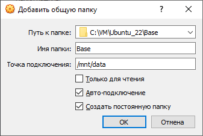

# 06. Физический уровень PostgreSQL 

План действий:
1. Добавляем новую БД `db_lesson7`, создаем новую таблицу `tbl_lesson7`.
2. Монтируем внешний диск по локальному пути /mnt/data
3. Переносим данные кластера из $PGDATA на внешний диск /mnt/data
4. Перенастраиваем PG так, чтобы $PGDATA смотрела на новый путь /mnt/data.

Доп. задание со звездочкой *:

5. Монтируем внешний диск с данными по локальному пути /mnt/data в другую VM, проверяем работоспособность.

По сути, это задание схоже с заданием к лекции [03](https://github.com/LikerPic/OTUS/blob/master/PostgreSQL/03/homework.md), где данные PG кластера за счет маппинга лежали особняком (снаружи контейнеров) и далее к БД шло обращение из разных контейнеров.


## создайте виртуальную машину c Ubuntu 20.04 LTS в GCE типа e2-medium в default VPC в любом регионе и зоне, например us-central1-a
## поставьте на нее PostgreSQL через sudo apt
## проверьте что кластер запущен через sudo -u postgres pg_lsclusters
Итак, имеем следующее:
```diff
+VM VirtualBox с Ubuntu 22.04
```
```console
vboxuser@Ubuntu22:~$ lsb_release -a
No LSB modules are available.
Distributor ID: Ubuntu
Description:    Ubuntu 22.04.1 LTS
Release:        22.04
Codename:       jammy
```
```diff
+Postgres 15
```
```console
vboxuser@Ubuntu22:~$ pg_lsclusters
Ver Cluster Port Status Owner    Data directory              Log file
15  main    5432 online postgres /var/lib/postgresql/15/main /var/log/postgresql/postgresql-15-main.log
```
Обращаем внимание на путь `$PGDATA=/var/lib/postgresql/15/main`. Ниже от нас потребуется изменить эту настройку.

## зайдите из под пользователя postgres в psql и сделайте произвольную таблицу с произвольным содержимым
Прежде всего сделаем полный клон нашей VM, назовем его `Ubuntu_22_clone`. Это нам пригодится в задании со звездочкой* в конце.
Пока работаем с VM `Ubuntu_22`.
```console
postgres=# create database db_lesson7;
CREATE DATABASE
postgres=# \c db_lesson7
You are now connected to database "db_lesson7" as user "postgres".
db_lesson7=# create table tbl_lesson7 (lucky_num int);
CREATE TABLE
db_lesson7=# insert into tbl_lesson7 values (555);
INSERT 0 1
db_lesson7=# insert into tbl_lesson7 values (777);
INSERT 0 1
db_lesson7=# select * from tbl_lesson7;
 lucky_num
-----------
       555
       777
(2 rows)
```
Для полноты картины определим OID БД и таблицы:
```console
db_lesson7=# SELECT pg_relation_filepath('tbl_lesson7');
 pg_relation_filepath
----------------------
 base/16401/16402
(1 row)
```
Убедимся, что по нашему пути файлы имеются:
```console
vboxuser@Ubuntu22:/var/lib/postgresql$ sudo ls -la /var/lib/postgresql/15/main/base/16401 | grep 16402
-rw------- 1 postgres postgres   8192 Feb 28 22:53 16402
```
## остановите postgres например через sudo -u postgres pg_ctlcluster 13 main stop
```console
vboxuser@Ubuntu22:/var/lib/postgresql$ sudo -u postgres pg_ctlcluster 15 main stop
Warning: stopping the cluster using pg_ctlcluster will mark the systemd unit as failed. Consider using systemctl:
  sudo systemctl stop postgresql@15-main
```
Убедимся:
```console
vboxuser@Ubuntu22:/var/lib/postgresql$ pg_lsclusters
Ver Cluster Port Status Owner    Data directory              Log file
15  main    5432 down   postgres /var/lib/postgresql/15/main /var/log/postgresql/postgresql-15-main.log
```

## создайте новый standard persistent диск GKE через Compute Engine -> Disks в том же регионе и зоне что GCE инстанс размером например 10GB
## добавьте свеже-созданный диск к виртуальной машине - надо зайти в режим ее редактирования и дальше выбрать пункт attach existing disk
В качестве внешнего диска используем Общую папку м/у хостовой и гостевой ОС и смонтируем её по пути '/mnt/data'
```console
vboxuser@Ubuntu22:~$ df -h
Filesystem      Size  Used Avail Use% Mounted on
tmpfs           485M  1.6M  483M   1% /run
/dev/sda3        24G   14G  9.2G  60% /
tmpfs           2.4G     0  2.4G   0% /dev/shm
tmpfs           5.0M  4.0K  5.0M   1% /run/lock
/dev/sda2       512M  6.1M  506M   2% /boot/efi
Upload          232G  136G   97G  59% /media/sf_Upload
tmpfs           485M   84K  484M   1% /run/user/127
tmpfs           485M   76K  484M   1% /run/user/1000
Base            232G  136G   97G  59% /mnt/data
```

## сделайте пользователя postgres владельцем /mnt/data - chown -R postgres:postgres /mnt/data/
```console
vboxuser@Ubuntu22:/mnt$ sudo chown -R postgres:postgres /mnt/data/
vboxuser@Ubuntu22:/mnt$ ll
total 8
drwxr-xr-x  3 root root   4096 Feb 28 23:23 ./
drwxr-xr-x 20 root root   4096 Feb  7 23:09 ../
drwxrwx---  1 root vboxsf    0 Feb 28 23:49 data/
```
Эффекта нет :(

В инете есть [подсказка](https://superuser.com/questions/640027/why-cant-i-chown-a-virtualbox-shared-folder), что общий каталог надо перемонтировать под нужным пользователем.
Для этого сначала узнаем id пользователя postgres:
```console
vboxuser@Ubuntu22:/mnt$ sudo -u postgres id
uid=130(postgres) gid=137(postgres) groups=137(postgres),114(ssl-cert)
```
Перемонтируем:
```console
vboxuser@Ubuntu22:/mnt$ sudo mount -t vboxsf -o remount,gid=137,uid=130,rw Base /mnt/data/
vboxuser@Ubuntu22:/mnt$ mount | grep data
Base on /mnt/data type vboxsf (rw,nodev,relatime,iocharset=utf8,uid=130,gid=137)
```
проверяем:
```console
vboxuser@Ubuntu22:/mnt$ ll
total 8
drwxr-xr-x  3 root     root     4096 Feb 28 23:23 ./
drwxr-xr-x 20 root     root     4096 Feb  7 23:09 ../
drwxrwxrwx  1 postgres postgres    0 Feb 28 23:49 data/
```
Получилось.

## перенесите содержимое /var/lib/postgres/13 в /mnt/data - mv /var/lib/postgresql/13 /mnt/data
```console
sudo mv /var/lib/postgresql/15 /mnt/data
```
Проверяем:
```console
vboxuser@Ubuntu22:/mnt$ sudo ls -la /var/lib/postgresql/15/main/base/16401 | grep 16402
ls: cannot access '/var/lib/postgresql/15/main/base/16401': No such file or directory
vboxuser@Ubuntu22:/mnt$ sudo ls -la /mnt/data/15/main/base/16401 | grep 16402
-rwxrwxrwx 1 postgres postgres   8192 Feb 28 22:53 16402
```

## попытайтесь запустить кластер - sudo -u postgres pg_ctlcluster 13 main start
```console
vboxuser@Ubuntu22:/mnt$ sudo -u postgres pg_ctlcluster 15 main start
Error: /var/lib/postgresql/15/main is not accessible or does not exist
```
## напишите получилось или нет и почему
Не получилось. Ругается на отсутствие каталога `$PGDATA=/var/lib/postgresql/15/main`
То есть, при запуске кластера система читаем конфиг postgresql.conf и далее проверяет существование $PGDATA (aka data_directory)

## задание: найти конфигурационный параметр в файлах раположенных в /etc/postgresql/13/main который надо поменять и поменяйте его
Чтобы по-честному найти путь к файлу конфигурации нужно вывести `show config_file;`, но пока сервис лежит такое не прокатит:
```console
vboxuser@Ubuntu22:/mnt$ sudo -u postgres psql
psql: error: connection to server on socket "/var/run/postgresql/.s.PGSQL.5432" failed: No such file or directory
        Is the server running locally and accepting connections on that socket?
```

Сделаем хитрость. Запустим предварительно склонированную VM `Ubuntu_22_clone` и подсмотрим там:
```console
vboxuser@Ubuntu22:~$ sudo -u postgres psql
postgres=# show config_file;
               config_file
-----------------------------------------
 /etc/postgresql/15/main/postgresql.conf
(1 row)
```

## напишите что и почему поменяли
Теперь, зная полный путь до файла конфигурации `/etc/postgresql/15/main/postgresql.conf` изменим настройку `data_directory` в файле:
```console
sudo nano /etc/postgresql/15/main/postgresql.conf
```
было:
```diff
-data_directory = '/var/lib/postgresql/15/main'          # use data in another directory
```
стало:
```diff
+data_directory = '/mnt/data/15/main'            # use data in another directory
```
## попытайтесь запустить кластер - sudo -u postgres pg_ctlcluster 13 main start
Перед запуском можно даже перепроверить, что PG подхватывает новый путь '$PGDATA'
```console
vboxuser@Ubuntu22:/mnt$ pg_lsclusters
Ver Cluster Port Status Owner    Data directory    Log file
15  main    5432 down   postgres /mnt/data/15/main /var/log/postgresql/postgresql-15-main.log
```
Запускаем:
```console
vboxuser@Ubuntu22:/mnt$ sudo -u postgres pg_ctlcluster 15 main start
Warning: the cluster will not be running as a systemd service. Consider using systemctl:
  sudo systemctl start postgresql@15-main
Error: /usr/lib/postgresql/15/bin/pg_ctl /usr/lib/postgresql/15/bin/pg_ctl start -D /mnt/data/15/main -l /var/log/postgresql/postgresql-15-main.log -s -o  -c config_file="/etc/postgresql/15/main/postgresql.conf"  exited with status 1:
2023-03-01 00:32:22.615 MSK [186353] FATAL:  data directory "/mnt/data/15/main" has invalid permissions
2023-03-01 00:32:22.615 MSK [186353] DETAIL:  Permissions should be u=rwx (0700) or u=rwx,g=rx (0750).
pg_ctl: could not start server
Examine the log output.
vboxuser@Ubuntu22:/mnt$ pg_lsclusters
Ver Cluster Port Status Owner    Data directory    Log file
15  main    5432 down   postgres /mnt/data/15/main /var/log/postgresql/postgresql-15-main.log
```

## напишите получилось или нет и почему
Не получилось. Теперь постгресу не нравится маска доступа на каталог $PGDATA.
Так как chmod не работает, то придется решать вопрос снова через mount. PG требует маску u=rwx (0700) или u=rwx,g=rx (0750). Интернет подсказывает, что в mount есть опция umask. Вычисляем umask с помощью любого онлайн-калькулятора и получаем umask=077.
Перемонтируем и проверим наши файлы:
```console
vboxuser@Ubuntu22:/mnt$ sudo mount -t vboxsf -o remount,gid=137,uid=130,umask=077,rw Base /mnt/data/
vboxuser@Ubuntu22:/mnt$ sudo ls -ld /mnt/data/15/main
drwx------ 1 postgres postgres 4096 Mar  1 01:07 /mnt/data/15/main
vboxuser@Ubuntu22:/mnt$ sudo ls -la /mnt/data/15/main/base/16401 | grep 16402
-rwx------ 1 postgres postgres   8192 Feb 28 22:53 16402
```
Выглядит неплохо.
Стартуем PG:
```console
vboxuser@Ubuntu22:/mnt$ sudo -u postgres pg_ctlcluster 15 main start
Warning: the cluster will not be running as a systemd service. Consider using systemctl:
  sudo systemctl start postgresql@15-main
vboxuser@Ubuntu22:/mnt$ pg_lsclusters
Ver Cluster Port Status Owner     Data directory    Log file
15  main    5432 online <unknown> /mnt/data/15/main /var/log/postgresql/postgresql-15-main.log
```
Получилось!


## зайдите через через psql и проверьте содержимое ранее созданной таблицы
```console
vboxuser@Ubuntu22:/mnt$ sudo -u postgres psql
psql (15.1 (Ubuntu 15.1-1.pgdg22.04+1))
Type "help" for help.

postgres=# \l
                                                  List of databases
    Name    |  Owner   | Encoding |   Collate   |    Ctype    | ICU Locale | Locale Provider |   Access privileges
------------+----------+----------+-------------+-------------+------------+-----------------+-----------------------
 db_lesson7 | postgres | UTF8     | en_US.UTF-8 | en_US.UTF-8 |            | libc            |
 iso        | postgres | UTF8     | en_US.UTF-8 | en_US.UTF-8 |            | libc            |
 postgres   | postgres | UTF8     | en_US.UTF-8 | en_US.UTF-8 |            | libc            |
 template0  | postgres | UTF8     | en_US.UTF-8 | en_US.UTF-8 |            | libc            | =c/postgres          +
            |          |          |             |             |            |                 | postgres=CTc/postgres
 template1  | postgres | UTF8     | en_US.UTF-8 | en_US.UTF-8 |            | libc            | =c/postgres          +
            |          |          |             |             |            |                 | postgres=CTc/postgres
(5 rows)

postgres=# \c db_lesson7
You are now connected to database "db_lesson7" as user "postgres".
db_lesson7=# select * from tbl_lesson7;
 lucky_num
-----------
       555
       777
(2 rows)
```
Ок. Данные подтянулись.

## задание со звездочкой *: не удаляя существующий GCE инстанс сделайте новый, поставьте на его PostgreSQL, удалите файлы с данными из /var/lib/postgres, перемонтируйте внешний диск который сделали ранее от первой виртуальной машины ко второй и запустите PostgreSQL на второй машине так чтобы он работал с данными на внешнем диске, расскажите как вы это сделали и что в итоге получилось.

Останавливаем VM `Ubuntu_22`. 

Настроим для VM `Ubuntu_22_clone` Общий каталог от `Ubuntu_22`:



Запустим VM `Ubuntu_22_clone`.

Проверим сразу доступы на каталоги БД:
```console
vboxuser@Ubuntu22:~$ sudo ls -ld /mnt/data/15/main
drwxrwx--- 1 root vboxsf 4096 Mar  1 01:21 /mnt/data/15/main
```
Перемонтируем и проверяем:
```console
vboxuser@Ubuntu22:~$ sudo mount -t vboxsf -o remount,gid=137,uid=130,umask=077,rw Base /mnt/data/
vboxuser@Ubuntu22:~$ sudo ls -ld /mnt/data/15/main
drwx------ 1 postgres postgres 4096 Mar  1 01:21 /mnt/data/15/main
```
Теперь Ок.

Убедимся, что мы имеем старый вариант кластера на котором нет нашей БД `db_lesson7`:
```console
vboxuser@Ubuntu22:~$ pg_lsclusters
Ver Cluster Port Status Owner    Data directory              Log file
15  main    5432 online postgres /var/lib/postgresql/15/main /var/log/postgresql/postgresql-15-main.log
vboxuser@Ubuntu22:~$ sudo -u postgres psql
could not change directory to "/home/vboxuser": Permission denied
psql (15.1 (Ubuntu 15.1-1.pgdg22.04+1))
Type "help" for help.

postgres=# \l
                                                 List of databases
   Name    |  Owner   | Encoding |   Collate   |    Ctype    | ICU Locale | Locale Provider |   Access privileges
-----------+----------+----------+-------------+-------------+------------+-----------------+-----------------------
 iso       | postgres | UTF8     | en_US.UTF-8 | en_US.UTF-8 |            | libc            |
 postgres  | postgres | UTF8     | en_US.UTF-8 | en_US.UTF-8 |            | libc            |
 template0 | postgres | UTF8     | en_US.UTF-8 | en_US.UTF-8 |            | libc            | =c/postgres          +
           |          |          |             |             |            |                 | postgres=CTc/postgres
 template1 | postgres | UTF8     | en_US.UTF-8 | en_US.UTF-8 |            | libc            | =c/postgres          +
           |          |          |             |             |            |                 | postgres=CTc/postgres
(4 rows)
```

Остановим кластер:
```console
vboxuser@Ubuntu22:~$ sudo -u postgres pg_ctlcluster 15 main stop
Warning: stopping the cluster using pg_ctlcluster will mark the systemd unit as failed. Consider using systemctl:
  sudo systemctl stop postgresql@15-main
vboxuser@Ubuntu22:~$ pg_lsclusters
Ver Cluster Port Status Owner    Data directory              Log file
15  main    5432 down   postgres /var/lib/postgresql/15/main /var/log/postgresql/postgresql-15-main.log
```

Удаляем данные текущего кластера:
```console
sudo rm -R /var/lib/postgresql/15/main
vboxuser@Ubuntu22:~$ sudo -u postgres pg_ctlcluster 15 main start
Error: /var/lib/postgresql/15/main is not accessible or does not exist
```

Перенастраиваем $PGDATA на /mnt/data как это делали выше:
```console
sudo nano /etc/postgresql/15/main/postgresql.conf
vboxuser@Ubuntu22:~$ pg_lsclusters
Ver Cluster Port Status Owner     Data directory    Log file
15  main    5432 down   <unknown> /mnt/data/15/main /var/log/postgresql/postgresql-15-main.log
```
Стартуем PG:
```console
vboxuser@Ubuntu22:~$ sudo -u postgres pg_ctlcluster 15 main start
Warning: the cluster will not be running as a systemd service. Consider using systemctl:
  sudo systemctl start postgresql@15-main
```

Проверяем наши данные:
```console
vboxuser@Ubuntu22:~$ sudo -u postgres psql
psql (15.1 (Ubuntu 15.1-1.pgdg22.04+1))
Type "help" for help.

postgres=# \l
                                                  List of databases
    Name    |  Owner   | Encoding |   Collate   |    Ctype    | ICU Locale | Locale Provider |   Access privileges
------------+----------+----------+-------------+-------------+------------+-----------------+-----------------------
 db_lesson7 | postgres | UTF8     | en_US.UTF-8 | en_US.UTF-8 |            | libc            |
 iso        | postgres | UTF8     | en_US.UTF-8 | en_US.UTF-8 |            | libc            |
 postgres   | postgres | UTF8     | en_US.UTF-8 | en_US.UTF-8 |            | libc            |
 template0  | postgres | UTF8     | en_US.UTF-8 | en_US.UTF-8 |            | libc            | =c/postgres          +
            |          |          |             |             |            |                 | postgres=CTc/postgres
 template1  | postgres | UTF8     | en_US.UTF-8 | en_US.UTF-8 |            | libc            | =c/postgres          +
            |          |          |             |             |            |                 | postgres=CTc/postgres
(5 rows)

postgres=# \c db_lesson7
You are now connected to database "db_lesson7" as user "postgres".
db_lesson7=# select * from tbl_lesson7 ;
 lucky_num
-----------
       555
       777
(2 rows)
```
Ок. Все данные на месте.
