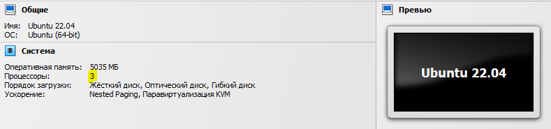

# **08. MVCC, vacuum и autovacuum**

## 1 создать GCE инстанс типа e2-medium и диском 10GB
```diff
+Имеем VM VirtualBox с Ubuntu 22.04. Диск 25GB. Доступно 9GB
```
```console
vboxuser@Ubuntu22:~$ df -h /
Filesystem      Size  Used Avail Use% Mounted on
/dev/sda3        24G   14G  9.0G  61% /

```
На VM выделено **3 CPU**:



```console
vboxuser@Ubuntu22:~$ lscpu
Architecture:            x86_64
  CPU op-mode(s):        32-bit, 64-bit
  Address sizes:         39 bits physical, 48 bits virtual
  Byte Order:            Little Endian
CPU(s):                  3
  On-line CPU(s) list:   0-2
Vendor ID:               GenuineIntel
  Model name:            Intel(R) Core(TM) i7-8750H CPU @ 2.20GHz
    CPU family:          6
    Model:               158
    Thread(s) per core:  1
    Core(s) per socket:  3
    Socket(s):           1
    Stepping:            10
    BogoMIPS:            4415.98
```


## установить на него PostgreSQL 14 с дефолтными настройками
Ниже будем использовать docker контейнер `postgres:14`

## применить параметры настройки PostgreSQL из прикрепленного к материалам занятия файла
Файл к занятию:
```
max_connections = 40
shared_buffers = 1GB
effective_cache_size = 3GB
maintenance_work_mem = 512MB
checkpoint_completion_target = 0.9
wal_buffers = 16MB
default_statistics_target = 500
random_page_cost = 4
effective_io_concurrency = 2
work_mem = 6553kB
min_wal_size = 4GB
max_wal_size = 16GB
```

Чтобы задавать настройки кластера будем использовать файл настроек `my-postgres.conf` снаружи контейнера и будем передавать его в качестве параметра.
Подготовим файл с настройками `my-postgres.conf`:
```console
docker run -i --rm postgres:14 cat /usr/share/postgresql/postgresql.conf.sample > my-postgres.conf
```
Запустим контейнер:
```console
docker run -d \
--name pg_lesson8 \
-v "$PWD/my-postgres.conf":/etc/postgresql/postgresql.conf \
-e POSTGRES_PASSWORD=postgres \
-p 6432:5432 \
postgres:14 \
-c "config_file=/etc/postgresql/postgresql.conf"
```
Проверим дефолтную конфигурацию:
```console
vboxuser@Ubuntu22:/media/sf_Upload$ psql -h localhost -p 6432 -U postgres
Password for user postgres:
psql (15.1 (Ubuntu 15.1-1.pgdg22.04+1), server 14.6 (Debian 14.6-1.pgdg110+1))
Type "help" for help.

postgres=# select name,setting,unit from pg_settings where name IN
('max_connections',
'shared_buffers',
'effective_cache_size',
'maintenance_work_mem',
'checkpoint_completion_target',
'wal_buffers',
'default_statistics_target',
'random_page_cost',
'effective_io_concurrency',
'work_mem',
'min_wal_size',
'max_wal_size');
             name             | setting | unit
------------------------------+---------+------
 checkpoint_completion_target | 0.9     |
 default_statistics_target    | 100     |
 effective_cache_size         | 524288  | 8kB
 effective_io_concurrency     | 1       |
 maintenance_work_mem         | 65536   | kB
 max_connections              | 100     |
 max_wal_size                 | 1024    | MB
 min_wal_size                 | 80      | MB
 random_page_cost             | 4       |
 shared_buffers               | 1024    | 8kB
 wal_buffers                  | 32      | 8kB
 work_mem                     | 4096    | kB
(12 rows)
```
Удалим контейнер.
```console
docker stop pg_lesson8; docker rm pg_lesson8
```

Отредактируем файл конфигурации `my-postgres.conf` - добавим параметры из файла к уроку.
Запускаем новый контейнер с новыми настройками.
Проверяем, что настройки применились:
```console
             name             | setting | unit
------------------------------+---------+------
 checkpoint_completion_target | 0.9     |
 default_statistics_target    | 500     |
 effective_cache_size         | 393216  | 8kB
 effective_io_concurrency     | 2       |
 maintenance_work_mem         | 524288  | kB
 max_connections              | 40      |
 max_wal_size                 | 16384   | MB
 min_wal_size                 | 4096    | MB
 random_page_cost             | 4       |
 shared_buffers               | 131072  | 8kB
 wal_buffers                  | 2048    | 8kB
 work_mem                     | 6553    | kB
```
Ок.


## выполнить pgbench -i postgres
`pgbench` — это простая программа для запуска тестов производительности Postgres Pro. Она многократно выполняет одну последовательность команд, возможно в параллельных сеансах базы данных, а затем вычисляет среднюю скорость транзакций (число транзакций в секунду). По умолчанию pgbench тестирует сценарий, примерно соответствующий TPC-B, который состоит из пяти команд SELECT, UPDATE и INSERT в одной транзакции. Однако вы можете легко протестировать и другие сценарии, написав собственные скрипты транзакций.
Точный состав транзакции указан в описании `pgbench` по ссылке в конце дока.

Работа `pgbench` разделяется на два режима:
- инициализация - `pgbench -i [option...] dbname`;
- нагрузочное тестирование - `pgbench [option...] dbname`.

Параметры инициализации:
| Параметр | Описание |
| ------ | ------ |
| `-i`|        Обязательный для вызова режима инициализации|

Параметры нагрузочного тестирования:
| Параметр | Описание |
| ------ | ------ |
|`--client` , `-c` |     Число имитируемых клиентов, то есть число одновременных сеансов базы данных. Значение по умолчанию — 1.|
|`--progress` , `-P` | Выводить отчёт о прогрессе через заданное число секунд (сек)|
|`--time` , `-T` | Выполнять тест с ограничением по времени (в секундах), а не по числу транзакций для каждого клиента|

Общие параметры для обоих режимов:
| Параметр | Описание |
| ------ | ------ |
|`--host` , `-h`|     Адрес сервера баз данных|
|`--port` , `-p`|     Номер порта сервера баз данных|
|`--username` , `-U`|  Имя пользователя для подключения|

Выполним инициализацию (в БД `postgres` будут подготовлены таблицы для тестирования):
```console
vboxuser@Ubuntu22:/media/sf_Upload$ pgbench -i -h localhost -p 6432 -U postgres postgres
Password:
dropping old tables...
NOTICE:  table "pgbench_accounts" does not exist, skipping
NOTICE:  table "pgbench_branches" does not exist, skipping
NOTICE:  table "pgbench_history" does not exist, skipping
NOTICE:  table "pgbench_tellers" does not exist, skipping
creating tables...
generating data (client-side)...
100000 of 100000 tuples (100%) done (elapsed 0.07 s, remaining 0.00 s)
vacuuming...
creating primary keys...
done in 0.57 s (drop tables 0.00 s, create tables 0.02 s, client-side generate 0.27 s, vacuum 0.18 s, primary keys 0.10 s).
```

## запустить pgbench -c8 -P 60 -T 600 -U postgres postgres
Запустим нагрузочный тест с параметрами:
- кол-во клиентов = 8;
- периодичность вывода отчета = 1 мин;
- длительность теста = 10 мин
```console
pgbench -c 8 -P 60 -T 600 -h localhost -p 6432 -U postgres postgres
```
Пока ждем окончания теста можем убедиться, что `pgbench` открыл 8 коннектов:
```console
vboxuser@Ubuntu22:/media/sf_Upload$ netstat -na|grep 6432
Proto Recv-Q Send-Q Local Address           Foreign Address         State
tcp        0      0 0.0.0.0:6432            0.0.0.0:*               LISTEN
tcp        0     74 127.0.0.1:33990         127.0.0.1:6432          ESTABLISHED
tcp        0     75 127.0.0.1:33974         127.0.0.1:6432          ESTABLISHED
tcp        0     10 127.0.0.1:34008         127.0.0.1:6432          ESTABLISHED
tcp        0     76 127.0.0.1:33938         127.0.0.1:6432          ESTABLISHED
tcp        0     74 127.0.0.1:33966         127.0.0.1:6432          ESTABLISHED
tcp        0     74 127.0.0.1:33950         127.0.0.1:6432          ESTABLISHED
tcp        0     75 127.0.0.1:33994         127.0.0.1:6432          ESTABLISHED
tcp        0     74 127.0.0.1:33984         127.0.0.1:6432          ESTABLISHED
tcp        0      0 127.0.0.1:6432          127.0.0.1:33950         ESTABLISHED
tcp        0      0 127.0.0.1:6432          127.0.0.1:33938         ESTABLISHED
tcp        0      0 127.0.0.1:6432          127.0.0.1:34008         ESTABLISHED
tcp        0      0 127.0.0.1:6432          127.0.0.1:33990         ESTABLISHED
tcp        0      0 127.0.0.1:6432          127.0.0.1:33974         ESTABLISHED
tcp        0      0 127.0.0.1:6432          127.0.0.1:33994         ESTABLISHED
tcp        0      0 127.0.0.1:6432          127.0.0.1:33984         ESTABLISHED
tcp        0      0 127.0.0.1:6432          127.0.0.1:33966         ESTABLISHED
tcp6       0      0 :::6432                 :::*                    LISTEN
```
Видим 8 активных сокетов сервера и 8 у клиента.

## дать отработать до конца
Результат теста:
```console
vboxuser@Ubuntu22:/media/sf_Upload$ pgbench -c 8 -P 60 -T 600 -h localhost -p 6432 -U postgres postgres
Password:
pgbench (15.1 (Ubuntu 15.1-1.pgdg22.04+1), server 14.6 (Debian 14.6-1.pgdg110+1))
starting vacuum...end.
progress: 60.0 s, 557.1 tps, lat 14.303 ms stddev 7.309, 0 failed
progress: 120.0 s, 559.8 tps, lat 14.283 ms stddev 7.633, 0 failed
progress: 180.0 s, 562.2 tps, lat 14.227 ms stddev 7.410, 0 failed
progress: 240.0 s, 558.2 tps, lat 14.327 ms stddev 7.663, 0 failed
progress: 300.0 s, 552.4 tps, lat 14.477 ms stddev 7.925, 0 failed
progress: 360.0 s, 561.0 tps, lat 14.255 ms stddev 7.479, 0 failed
progress: 420.0 s, 559.7 tps, lat 14.288 ms stddev 7.268, 0 failed
progress: 480.0 s, 554.8 tps, lat 14.413 ms stddev 7.610, 0 failed
progress: 540.0 s, 551.7 tps, lat 14.495 ms stddev 7.787, 0 failed
progress: 600.0 s, 547.2 tps, lat 14.615 ms stddev 8.049, 0 failed
transaction type: <builtin: TPC-B (sort of)>
scaling factor: 1
query mode: simple
number of clients: 8
number of threads: 1
maximum number of tries: 1
duration: 600 s
number of transactions actually processed: 333861
number of failed transactions: 0 (0.000%)
latency average = 14.368 ms
latency stddev = 7.617 ms
initial connection time = 210.439 ms
tps = 556.606185 (without initial connection time)
```

## дальше настроить autovacuum максимально эффективно
Для `autovacuum` предусмотрено 14 параметров:
```console
postgres=# SELECT name, setting, context, short_desc FROM pg_settings WHERE name like 'autovacuum%';
                 name                  |  setting  |  context   |                                        short_desc
---------------------------------------+-----------+------------+-------------------------------------------------------------------------------------------
 autovacuum                            | on        | sighup     | Запускает подпроцесс автоочистки.
 autovacuum_analyze_scale_factor       | 0.1       | sighup     | Отношение числа добавлений, обновлений или удалений кортежей к reltuples, определяющее потребность в анализе.
 autovacuum_analyze_threshold          | 50        | sighup     | Минимальное число добавлений, изменений или удалений кортежей, вызывающее анализ.
 autovacuum_freeze_max_age             | 200000000 | postmaster | Возраст, при котором необходима автоочистка таблицы для предотвращения зацикливания ID транзакций.
 autovacuum_max_workers                | 3         | postmaster | Задаёт предельное число одновременно выполняющихся рабочих процессов автоочистки.
 autovacuum_multixact_freeze_max_age   | 400000000 | postmaster | Возраст multixact, при котором необходима автоочистка таблицы для предотвращения зацикливания multixact.
 autovacuum_naptime                    | 60        | sighup     | Время простоя между запусками автоочистки.
 autovacuum_vacuum_cost_delay          | 2         | sighup     | Задержка очистки для автоочистки (в миллисекундах).
 autovacuum_vacuum_cost_limit          | -1        | sighup     | Суммарная стоимость очистки, при которой нужна передышка, для автоочистки.
 autovacuum_vacuum_insert_scale_factor | 0.2       | sighup     | Отношение числа добавлений кортежей к reltuples, определяющее потребность в очистке.
 autovacuum_vacuum_insert_threshold    | 1000      | sighup     | Минимальное число добавлений кортежей, вызывающее очистку; при -1 такая очистка отключается.
 autovacuum_vacuum_scale_factor        | 0.2       | sighup     | Отношение числа обновлений или удалений кортежей к reltuples, определяющее потребность в очистке.
 autovacuum_vacuum_threshold           | 50        | sighup     | Минимальное число изменений или удалений кортежей, вызывающее очистку.
 autovacuum_work_mem                   | -1        | sighup     | Задаёт предельный объём памяти для каждого рабочего процесса автоочистки.
(14 rows)
```


## построить график по получившимся значениям так чтобы получить максимально ровное значение tps

