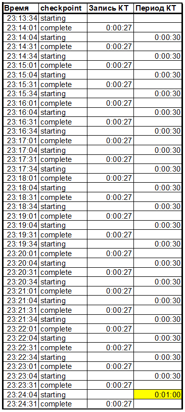

# **09. Журналы**
```diff
+Имеем VM VirtualBox с Ubuntu 22.04 + Docker
```

## 1. Настройте выполнение контрольной точки раз в 30 секунд.

Получим текущие настройки **CHECKPOINT**:
```console
SELECT name, setting, unit, short_desc FROM pg_settings WHERE name like '%checkpoint%';
             name             | setting | unit |                                        short_desc
------------------------------+---------+------+------------------------------------------------------------------------------------------
 checkpoint_completion_target | 0.9     |      | Отношение продолжительности сброса "грязных" буферов во время контрольной точки к интервалу контрольных точек.
 checkpoint_flush_after       | 32      | 8kB  | Число страниц, по достижении которого ранее выполненные операции записи сбрасываются на диск.
 checkpoint_timeout           | 300     | s    | Задаёт максимальное время между автоматическими контрольными точками WAL.
 checkpoint_warning           | 30      | s    | Задаёт максимальный интервал, в котором выдаётся предупреждение о том, что контрольные точки, вызванные активностью WAL, происходят слишком часто.
 log_checkpoints              | off     |      | Протоколировать каждую контрольную точку.
(5 rows)
```
Из интересного здесь:
- `checkpoint_timeout` - периодичность срабатывания КТ (с);
- `checkpoint_completion_target` - доля, применяемая к величине `checkpoint_timeout`. Задает время работы КТ (нужно для того, чтобы уменьшить нажим сброса грязных страниц);
- `log_checkpoints` - позволяет включать логирование каждой КТ. Нам в тесте это очень пригодится.

В конфиг-файле `my-postgres.conf` выставим:
- `checkpoint_timeout` = 30s;
- `log_checkpoints` = on.

---
Определим статус **ЛОГИРОВАНИЯ**:

Чтобы найти лог-файл PG, нужно обратиться в `$PGDATA` / `log_directory` (считаем, что путь указан относительный). При этом в контейнере почему-то выключено логирование `logging_collector`:
```console
postgres=# SELECT name, setting, unit, short_desc FROM pg_settings WHERE name IN ('data_directory','logging_collector','log_directory','log_filename');
       name        |            setting             | unit |                                 short_desc
-------------------+--------------------------------+------+----------------------------------------------------------------------------
 data_directory    | /var/lib/postgresql/data       |      | Sets the server's data directory.
 log_directory     | log                            |      | Sets the destination directory for log files.
 log_filename      | postgresql-%Y-%m-%d_%H%M%S.log |      | Sets the file name pattern for log files.
 logging_collector | off                            |      | Start a subprocess to capture stderr output and/or csvlogs into log files.
(4 rows)
```
Зная, что потребуется собрать информацию по отработавшим контрольным точкам, позабоитмся заранее о включении логирования.
В моем случае лог будем искать здесь: `/var/lib/postgresql/data/log`.
В конфиг-файле `my-postgres.conf` выставим:
- `logging_collector` = on
---

Определим настройки **WAL**:
```console
postgres=# SELECT name, setting, unit, short_desc FROM pg_settings WHERE name like '%wal%';
             name              |  setting  | unit |                                                 short_desc
-------------------------------+-----------+------+------------------------------------------------------------------------------------------------------------
 max_slot_wal_keep_size        | -1        | MB   | Задаёт максимальный размер WAL, который могут резервировать слоты репликации.
 max_wal_senders               | 10        |      | Задаёт предельное число одновременно работающих процессов передачи WAL.
 max_wal_size                  | 1024      | MB   | Задаёт размер WAL, при котором инициируется контрольная точка.
 min_wal_size                  | 80        | MB   | Задаёт минимальный размер WAL при сжатии.
 track_wal_io_timing           | off       |      | Собирает статистику по времени активности ввода/вывода WAL.
 wal_block_size                | 8192      |      | Показывает размер блока в журнале WAL.
 wal_buffers                   | 512       | 8kB  | Задаёт число буферов дисковых страниц в разделяемой памяти для WAL.
 wal_compression               | off       |      | Сжимать данные записываемых в WAL полных страниц заданным методом.
 wal_consistency_checking      |           |      | Задаёт перечень менеджеров ресурсов WAL, для которых выполняются проверки целостности WAL.
 wal_init_zero                 | on        |      | Записывать нули в новые файлы WAL перед первым использованием.
 wal_keep_size                 | 0         | MB   | Определяет предельный объём файлов WAL, сохраняемых для резервных серверов.
 wal_level                     | replica   |      | Задаёт уровень информации, записываемой в WAL.
 wal_log_hints                 | off       |      | Запись полных страниц в WAL при первом изменении после контрольной точки, даже при некритическом изменении.
 wal_receiver_create_temp_slot | off       |      | Определяет, должен ли приёмник WAL создавать временный слот репликации, если не настроен постоянный слот.
 wal_receiver_status_interval  | 10        | s    | Задаёт максимальный интервал между отчётами о состоянии приёмника WAL, отправляемыми передающему серверу.
 wal_receiver_timeout          | 60000     | ms   | Задаёт предельное время ожидания для получения данных от передающего сервера.
 wal_recycle                   | on        |      | Перерабатывать файлы WAL, производя переименование.
 wal_retrieve_retry_interval   | 5000      | ms   | Задаёт время задержки перед повторной попыткой обращения к WAL после неудачи.
 wal_segment_size              | 16777216  | B    | Показывает размер сегментов журнала предзаписи.
 wal_sender_timeout            | 60000     | ms   | Задаёт предельное время ожидания репликации WAL.
 wal_skip_threshold            | 2048      | kB   | Размер нового файла, при достижении которого файл не пишется в WAL, а сбрасывается на диск.
 wal_sync_method               | fdatasync |      | Выбирает метод принудительной записи изменений в WAL на диск.
 wal_writer_delay              | 200       | ms   | Задержка между сбросом WAL в процессе, записывающем WAL.
 wal_writer_flush_after        | 128       | 8kB  | Объём WAL, обработанный пишущим WAL процессом, при котором инициируется сброс журнала на диск.
(24 rows)

postgres=# SELECT name, setting, unit, short_desc FROM pg_settings WHERE name IN ('fsync','synchronous_commit','commit_delay','commit_siblings');
        name        | setting | unit |                                     short_desc
--------------------+---------+------+-------------------------------------------------------------------------------------
 commit_delay       | 0       |      | Задаёт задержку в микросекундах между фиксированием транзакций и сбросом WAL на диск.
 commit_siblings    | 5       |      | Задаёт минимальное число одновременно открытых транзакций, которое требуется для применения commit_delay.
 fsync              | on      |      | Принудительная запись изменений на диск.
 synchronous_commit | on      |      | Задаёт уровень синхронизации текущей транзакции.
(4 rows)
```
Из интересного:
- `wal_segment_size` - размер WAK-файла. Дефолт 16777216 = 16 МБ
- `wal_keep_size` - позволяет хранить файлы WAL в заданном минимальной объеме (`min_wal_size` здесь не срабатывает почему-то)
- `fsync` - по сути включает/отключает синхронный режим записи журнла.

**ПУТЬ хранения WAL-файлов**:
- настройки для каталога нет;
- путь: `$PGDATA` / `pg_wal`;
- для вынесения WAL на отдельные диски нужно использовать симлинк;
- для получения списка файлов есть функция: `SELECT * FROM pg_ls_waldir() ORDER BY modification;`
- размер одного файла = 16 МБ по умолчанию;
- имя файла состоит из двух частей:
  -  старшие 8 шестнадцатеричных разрядов показывают номер ветви времени (она используется при восстановлении из резервной копии)
  -  остаток соответствует старшим разрядам LSN (а оставшиеся младшие разряды LSN показывают смещение) - см `pg_walfile_name_offset`.

Файлы хранятся в минимально необходимом объеме (для возможности восстановления с последней КТ) и перезаписываются по кругу. Файлы также требуются для репликации и архивации.

В конфиг-файле `my-postgres.conf` выставим:
- `wal_keep_size` = 200
---
Итого, кластер будем запускать с такими настройками `my-postgres.conf`:
```diff
+ checkpoint_timeout = 30s
+ wal_keep_size = 200
+ logging_collector = on
+ log_checkpoints = on
```

## 2. 10 минут c помощью утилиты pgbench подавайте нагрузку.
Итак, потребуется определить объем журнальный файлов. Это можно сделать следующими способами:
- заглянуть в каталог `pg_wal` (для этого нужно, чтобы система хранила весь необходимый объем транзакций);
- альтернатива заглядывания в каталог: `pg_ls_waldir()`;
- определить дельту по счетчику LSN (Log Sequence Number): `pg_current_wal_insert_lsn()` + `pg_controldata`;
- через кол-во записанных буферов в статистике `pg_stat_bgwriter.buffers_checkpoint` (сомнительно, т.к. объем журнала != объему БД);
- статистика из файлов: `pg_waldump -z` (для этого нужно, чтобы система хранила весь необходимый объем транзакций).

**LSN** — это 64-битное целое число, представляющее байтовое смещение в потоке журнала предзаписи. Он выводится в виде двух шестнадцатеричных чисел до 8 цифр каждое, через косую черту, например: 16/B374D848

---
Запустим сервер с актуальными настройками:
```console
vboxuser@Ubuntu22:/media/sf_Upload$ docker stop pg_lesson9; docker rm pg_lesson9
pg_lesson9
pg_lesson9
vboxuser@Ubuntu22:/media/sf_Upload$ docker run -d --name pg_lesson9 -v "$PWD/my-postgres.conf":/etc/postgresql/postgresql.conf -e POSTGRES_PASSWORD=postgres -p 6432:5432 postgres:14 -c "config_file=/etc/postgresql/postgresql.conf"
a7b99539cd5da976d6a0ef4d1c37767c8bc023751fef120b3bc2364613c136ea
```
Выполним инициализацию:
```console
vboxuser@Ubuntu22:~$ pgbench -i -h localhost -p 6432 -U postgres postgres
Password:
dropping old tables...
NOTICE:  table "pgbench_accounts" does not exist, skipping
NOTICE:  table "pgbench_branches" does not exist, skipping
NOTICE:  table "pgbench_history" does not exist, skipping
NOTICE:  table "pgbench_tellers" does not exist, skipping
creating tables...
generating data (client-side)...
100000 of 100000 tuples (100%) done (elapsed 0.06 s, remaining 0.00 s)
vacuuming...
creating primary keys...
done in 0.51 s (drop tables 0.00 s, create tables 0.01 s, client-side generate 0.29 s, vacuum 0.11 s, primary keys 0.10 s).
```
Получим срезы перед сбором статистики.

Посмотрим на файлы:
```console
vboxuser@Ubuntu22:/media/sf_Upload$ docker exec -it pg_lesson9 bash
root@a7b99539cd5d:/# cd /var/lib/postgresql/data/pg_wal/
root@a7b99539cd5d:/var/lib/postgresql/data/pg_wal# ls -la
total 32780
drwx------  3 postgres postgres     4096 Mar  9 23:01 .
drwx------ 20 postgres postgres     4096 Mar  9 23:00 ..
-rw-------  1 postgres postgres 16777216 Mar  9 23:01 000000010000000000000001
-rw-------  1 postgres postgres 16777216 Mar  9 23:02 000000010000000000000002
drwx------  2 postgres postgres     4096 Mar  9 23:00 archive_status
root@a7b99539cd5d:/var/lib/postgresql/data/pg_wal# du -h .
4.0K    ./archive_status
33M     .
```
или так:
```console
vboxuser@Ubuntu22:~$ psql -h localhost -p 6432 -U postgres postgres
Password for user postgres:
psql (15.1 (Ubuntu 15.1-1.pgdg22.04+1), server 14.6 (Debian 14.6-1.pgdg110+1))
Type "help" for help.

postgres=# SELECT * FROM pg_ls_waldir() ORDER BY modification;
           name           |   size   |      modification
--------------------------+----------+------------------------
 000000010000000000000001 | 16777216 | 2023-03-09 23:01:55+00
 000000010000000000000002 | 16777216 | 2023-03-09 23:02:40+00
(2 rows)
```
LSN = 0/23841F0:
```console
postgres=# select pg_current_wal_insert_lsn();
 pg_current_wal_insert_lsn
---------------------------
 0/23841F0
(1 row)
```

`pg_controldata`:
```console
root@a7b99539cd5d:/var/lib/postgresql/data/pg_wal# pg_controldata
pg_control version number:            1300
Catalog version number:               202107181
Database system identifier:           7208685268148084774
Database cluster state:               in production
pg_control last modified:             Thu 09 Mar 2023 11:02:33 PM UTC
Latest checkpoint location:           0/2384140
Latest checkpoint's REDO location:    0/237F038
Latest checkpoint's REDO WAL file:    000000010000000000000002
Latest checkpoint's TimeLineID:       1
Latest checkpoint's PrevTimeLineID:   1
Latest checkpoint's full_page_writes: on
Latest checkpoint's NextXID:          0:745
Latest checkpoint's NextOID:          24576
Latest checkpoint's NextMultiXactId:  1
Latest checkpoint's NextMultiOffset:  0
Latest checkpoint's oldestXID:        727
Latest checkpoint's oldestXID's DB:   1
Latest checkpoint's oldestActiveXID:  745
Latest checkpoint's oldestMultiXid:   1
Latest checkpoint's oldestMulti's DB: 1
Latest checkpoint's oldestCommitTsXid:0
Latest checkpoint's newestCommitTsXid:0
Time of latest checkpoint:            Thu 09 Mar 2023 11:02:33 PM UTC
Fake LSN counter for unlogged rels:   0/3E8
Minimum recovery ending location:     0/0
Min recovery ending loc's timeline:   0
Backup start location:                0/0
Backup end location:                  0/0
End-of-backup record required:        no
wal_level setting:                    replica
wal_log_hints setting:                off
max_connections setting:              100
max_worker_processes setting:         8
max_wal_senders setting:              10
max_prepared_xacts setting:           0
max_locks_per_xact setting:           64
track_commit_timestamp setting:       off
Maximum data alignment:               8
Database block size:                  8192
Blocks per segment of large relation: 131072
WAL block size:                       8192
Bytes per WAL segment:                16777216
Maximum length of identifiers:        64
Maximum columns in an index:          32
Maximum size of a TOAST chunk:        1996
Size of a large-object chunk:         2048
Date/time type storage:               64-bit integers
Float8 argument passing:              by value
Data page checksum version:           0
Mock authentication nonce:            8bb002d3401ba9516d5ab95db8264eeb7ba06b1038e8c22b05abdb26f988c039
```

`pg_stat_bgwriter`:
```
postgres=# SELECT * FROM pg_stat_bgwriter \gx
-[ RECORD 1 ]---------+------------------------------
checkpoints_timed     | 20
checkpoints_req       | 1
checkpoint_write_time | 20976
checkpoint_sync_time  | 60
buffers_checkpoint    | 199
buffers_clean         | 0
maxwritten_clean      | 0
buffers_backend       | 3186
buffers_backend_fsync | 0
buffers_alloc         | 505
stats_reset           | 2023-03-09 23:00:32.827573+00
```
Запустим тест:
```console
vboxuser@Ubuntu22:~$ pgbench -c 8 -P 60 -T 600 -h localhost -p 6432 -U postgres postgres
Password:
pgbench (15.1 (Ubuntu 15.1-1.pgdg22.04+1), server 14.6 (Debian 14.6-1.pgdg110+1))
starting vacuum...end.
progress: 60.0 s, 544.2 tps, lat 14.638 ms stddev 8.365, 0 failed
progress: 120.0 s, 560.6 tps, lat 14.264 ms stddev 7.779, 0 failed
progress: 180.0 s, 552.2 tps, lat 14.482 ms stddev 8.200, 0 failed
progress: 240.0 s, 542.3 tps, lat 14.746 ms stddev 8.317, 0 failed
progress: 300.0 s, 548.4 tps, lat 14.582 ms stddev 8.338, 0 failed
progress: 360.0 s, 560.5 tps, lat 14.268 ms stddev 7.956, 0 failed
progress: 420.0 s, 548.8 tps, lat 14.573 ms stddev 8.160, 0 failed
progress: 480.0 s, 552.7 tps, lat 14.469 ms stddev 8.037, 0 failed
progress: 540.0 s, 546.5 tps, lat 14.631 ms stddev 8.091, 0 failed
progress: 600.0 s, 556.4 tps, lat 14.375 ms stddev 7.928, 0 failed
transaction type: <builtin: TPC-B (sort of)>
scaling factor: 1
query mode: simple
number of clients: 8
number of threads: 1
maximum number of tries: 1
duration: 600 s
number of transactions actually processed: 330764
number of failed transactions: 0 (0.000%)
latency average = 14.501 ms
latency stddev = 8.119 ms
initial connection time = 224.420 ms
tps = 551.460377 (without initial connection time)
```

## 3. Измерьте, какой объем журнальных файлов был сгенерирован за это время. Оцените, какой объем приходится в среднем на одну контрольную точку.
Во время теста стали добавляться новые wal-файлы:
```console
-rw-------  1 postgres postgres 16777216 Mar  9 23:01 000000010000000000000001
-rw-------  1 postgres postgres 16777216 Mar  9 23:13 000000010000000000000002
-rw-------  1 postgres postgres 16777216 Mar  9 23:13 000000010000000000000003
-rw-------  1 postgres postgres 16777216 Mar  9 23:14 000000010000000000000004
-rw-------  1 postgres postgres 16777216 Mar  9 23:14 000000010000000000000005
-rw-------  1 postgres postgres 16777216 Mar  9 23:14 000000010000000000000006
...
```
В конечном счете отведенного минимума 200+ МБ под журналы не хватило и система начала перезаписывать первые файлы.
В результате теста получилась такая картина:
```console
root@a7b99539cd5d:/var/lib/postgresql/data/pg_wal# ls -la
total 344076
drwx------  3 postgres postgres     4096 Mar  9 23:23 .
drwx------ 20 postgres postgres     4096 Mar  9 23:00 ..
-rw-------  1 postgres postgres 16777216 Mar  9 23:16 00000001000000000000000B
-rw-------  1 postgres postgres 16777216 Mar  9 23:16 00000001000000000000000C
-rw-------  1 postgres postgres 16777216 Mar  9 23:17 00000001000000000000000D
-rw-------  1 postgres postgres 16777216 Mar  9 23:17 00000001000000000000000E
-rw-------  1 postgres postgres 16777216 Mar  9 23:18 00000001000000000000000F
-rw-------  1 postgres postgres 16777216 Mar  9 23:18 000000010000000000000010
-rw-------  1 postgres postgres 16777216 Mar  9 23:18 000000010000000000000011
-rw-------  1 postgres postgres 16777216 Mar  9 23:19 000000010000000000000012
-rw-------  1 postgres postgres 16777216 Mar  9 23:19 000000010000000000000013
-rw-------  1 postgres postgres 16777216 Mar  9 23:19 000000010000000000000014
-rw-------  1 postgres postgres 16777216 Mar  9 23:20 000000010000000000000015
-rw-------  1 postgres postgres 16777216 Mar  9 23:20 000000010000000000000016
-rw-------  1 postgres postgres 16777216 Mar  9 23:21 000000010000000000000017
-rw-------  1 postgres postgres 16777216 Mar  9 23:21 000000010000000000000018
-rw-------  1 postgres postgres 16777216 Mar  9 23:21 000000010000000000000019
-rw-------  1 postgres postgres 16777216 Mar  9 23:22 00000001000000000000001A
-rw-------  1 postgres postgres 16777216 Mar  9 23:22 00000001000000000000001B
-rw-------  1 postgres postgres 16777216 Mar  9 23:22 00000001000000000000001C
-rw-------  1 postgres postgres 16777216 Mar  9 23:23 00000001000000000000001D
-rw-------  1 postgres postgres 16777216 Mar  9 23:23 00000001000000000000001E
-rw-------  1 postgres postgres 16777216 Mar  9 23:16 00000001000000000000001F
drwx------  2 postgres postgres     4096 Mar  9 23:00 archive_status
root@a7b99539cd5d:/var/lib/postgresql/data/pg_wal# du -h .
4.0K    ./archive_status
337M    .
```
или:
```console
postgres=# SELECT * FROM pg_ls_waldir() ORDER BY modification;
           name           |   size   |      modification
--------------------------+----------+------------------------
 00000001000000000000001F | 16777216 | 2023-03-09 23:16:08+00
 000000010000000000000020 | 16777216 | 2023-03-09 23:16:35+00
 00000001000000000000000C | 16777216 | 2023-03-09 23:16:58+00
 00000001000000000000000D | 16777216 | 2023-03-09 23:17:12+00
 00000001000000000000000E | 16777216 | 2023-03-09 23:17:37+00
 00000001000000000000000F | 16777216 | 2023-03-09 23:18:05+00
 000000010000000000000010 | 16777216 | 2023-03-09 23:18:27+00
 000000010000000000000011 | 16777216 | 2023-03-09 23:18:41+00
 000000010000000000000012 | 16777216 | 2023-03-09 23:19:07+00
 000000010000000000000013 | 16777216 | 2023-03-09 23:19:35+00
 000000010000000000000014 | 16777216 | 2023-03-09 23:19:55+00
 000000010000000000000015 | 16777216 | 2023-03-09 23:20:11+00
 000000010000000000000016 | 16777216 | 2023-03-09 23:20:36+00
 000000010000000000000017 | 16777216 | 2023-03-09 23:21:05+00
 000000010000000000000018 | 16777216 | 2023-03-09 23:21:25+00
 000000010000000000000019 | 16777216 | 2023-03-09 23:21:41+00
 00000001000000000000001A | 16777216 | 2023-03-09 23:22:06+00
 00000001000000000000001B | 16777216 | 2023-03-09 23:22:35+00
 00000001000000000000001C | 16777216 | 2023-03-09 23:22:56+00
 00000001000000000000001D | 16777216 | 2023-03-09 23:23:12+00
 00000001000000000000001E | 16777216 | 2023-03-09 23:24:39+00
(21 rows)
```
Перед тестом в каталоге последний файл был `02`. Далее система дошла до `1E`. То есть во время теста было записано 28 журнальных файлов.

Полный объем записанных журнальных файлов во время теста:
```diff
+ 28 * 16 МБ = 448 МБ
```

Так как весь тест не уместился в объем журнальных файлов, то методы определения объема жернала по содержимому файлов не помогут.

LSN = 0/1E0F7B70
```console
postgres=# select pg_current_wal_insert_lsn();
 pg_current_wal_insert_lsn
---------------------------
 0/1E0F7B70
(1 row)
```

Вычислим размер журнала м/у номерами LSN:

```console
postgres=# SELECT '0/1E0F7B70'::pg_lsn - '0/23841F0'::pg_lsn;
 ?column?
-----------
 467089792
(1 row)
```

```diff
+ То есть точный размер журнала во времия теста = 445 МБ
```

```console
root@a7b99539cd5d:/var/lib/postgresql/data/pg_wal# pg_controldata
pg_control version number:            1300
Catalog version number:               202107181
Database system identifier:           7208685268148084774
Database cluster state:               in production
pg_control last modified:             Thu 09 Mar 2023 11:24:31 PM UTC
Latest checkpoint location:           0/1E0F7AC0
Latest checkpoint's REDO location:    0/1E0F7A88
Latest checkpoint's REDO WAL file:    00000001000000000000001E
Latest checkpoint's TimeLineID:       1
Latest checkpoint's PrevTimeLineID:   1
Latest checkpoint's full_page_writes: on
Latest checkpoint's NextXID:          0:331564
Latest checkpoint's NextOID:          24576
Latest checkpoint's NextMultiXactId:  1
Latest checkpoint's NextMultiOffset:  0
Latest checkpoint's oldestXID:        727
Latest checkpoint's oldestXID's DB:   1
Latest checkpoint's oldestActiveXID:  331564
Latest checkpoint's oldestMultiXid:   1
Latest checkpoint's oldestMulti's DB: 1
Latest checkpoint's oldestCommitTsXid:0
Latest checkpoint's newestCommitTsXid:0
Time of latest checkpoint:            Thu 09 Mar 2023 11:24:04 PM UTC
Fake LSN counter for unlogged rels:   0/3E8
Minimum recovery ending location:     0/0
Min recovery ending loc's timeline:   0
Backup start location:                0/0
Backup end location:                  0/0
End-of-backup record required:        no
wal_level setting:                    replica
wal_log_hints setting:                off
max_connections setting:              100
max_worker_processes setting:         8
max_wal_senders setting:              10
max_prepared_xacts setting:           0
max_locks_per_xact setting:           64
track_commit_timestamp setting:       off
Maximum data alignment:               8
Database block size:                  8192
Blocks per segment of large relation: 131072
WAL block size:                       8192
Bytes per WAL segment:                16777216
Maximum length of identifiers:        64
Maximum columns in an index:          32
Maximum size of a TOAST chunk:        1996
Size of a large-object chunk:         2048
Date/time type storage:               64-bit integers
Float8 argument passing:              by value
Data page checksum version:           0
Mock authentication nonce:            8bb002d3401ba9516d5ab95db8264eeb7ba06b1038e8c22b05abdb26f988c039
```

`pg_stat_bgwriter`:
```
postgres=# SELECT * FROM pg_stat_bgwriter \gx
-[ RECORD 1 ]---------+------------------------------
checkpoints_timed     | 79
checkpoints_req       | 1
checkpoint_write_time | 579616
checkpoint_sync_time  | 429
buffers_checkpoint    | 2819
buffers_clean         | 224337
maxwritten_clean      | 378
buffers_backend       | 20498
buffers_backend_fsync | 0
buffers_alloc         | 205756
stats_reset           | 2023-03-09 23:00:32.827573+00
```
Судя по всему второй вызов pg_stat_bgwriter был с некоторым запозданием после окончания теста, поэтому в эту статистику попали лишние КТ.
За 10 минут теста должно было записаться 20 КТ. 
```diff
+ Средний размер КТ = 445 / 20 = 22 МБ
```

## 4. Проверьте данные статистики: все ли контрольные точки выполнялись точно по расписанию. Почему так произошло?

Если тут речь про статистику `pg_stat_bgwriter`, то не ясно как тут определять точность расписания. Тем более с учетом того, что в эту статистику записались КТ, не относящиеся к тесту.
Самое надежное - это заглянуть в лог и посмотреть на отсечки времени.

Краткий вариант лога:
```console
root@a7b99539cd5d:/var/lib/postgresql/data/log# cat postgresql-2023-03-09_230033.log
2023-03-09 23:01:03.155 GMT [64] LOG:  checkpoint starting: time
2023-03-09 23:01:03.172 GMT [64] LOG:  checkpoint complete: wrote 3 buffers (0.3%); 0 
2023-03-09 23:02:03.574 GMT [64] LOG:  checkpoint starting: time
2023-03-09 23:02:24.293 GMT [64] LOG:  checkpoint complete: wrote 197 buffers (19.2%);
2023-03-09 23:02:33.302 GMT [64] LOG:  checkpoint starting: time
2023-03-09 23:02:33.644 GMT [64] LOG:  checkpoint complete: wrote 3 buffers (0.3%); 0 
2023-03-09 23:13:34.158 GMT [64] LOG:  checkpoint starting: time
2023-03-09 23:14:01.178 GMT [64] LOG:  checkpoint complete: wrote 148 buffers (14.5%);
2023-03-09 23:14:04.016 GMT [64] LOG:  checkpoint starting: time
2023-03-09 23:14:31.050 GMT [64] LOG:  checkpoint complete: wrote 114 buffers (11.1%);
2023-03-09 23:14:34.135 GMT [64] LOG:  checkpoint starting: time
2023-03-09 23:15:01.059 GMT [64] LOG:  checkpoint complete: wrote 107 buffers (10.4%);
2023-03-09 23:15:04.752 GMT [64] LOG:  checkpoint starting: time
2023-03-09 23:15:31.165 GMT [64] LOG:  checkpoint complete: wrote 187 buffers (18.3%);
2023-03-09 23:15:34.223 GMT [64] LOG:  checkpoint starting: time
2023-03-09 23:16:01.043 GMT [64] LOG:  checkpoint complete: wrote 131 buffers (12.8%);
2023-03-09 23:16:04.840 GMT [64] LOG:  checkpoint starting: time
2023-03-09 23:16:31.058 GMT [64] LOG:  checkpoint complete: wrote 163 buffers (15.9%);
2023-03-09 23:16:34.250 GMT [64] LOG:  checkpoint starting: time
2023-03-09 23:17:01.083 GMT [64] LOG:  checkpoint complete: wrote 108 buffers (10.5%);
2023-03-09 23:17:04.612 GMT [64] LOG:  checkpoint starting: time
2023-03-09 23:17:31.074 GMT [64] LOG:  checkpoint complete: wrote 158 buffers (15.4%);
2023-03-09 23:17:34.291 GMT [64] LOG:  checkpoint starting: time
2023-03-09 23:18:01.117 GMT [64] LOG:  checkpoint complete: wrote 95 buffers (9.3%); 0
2023-03-09 23:18:04.805 GMT [64] LOG:  checkpoint starting: time
2023-03-09 23:18:31.041 GMT [64] LOG:  checkpoint complete: wrote 150 buffers (14.6%);
2023-03-09 23:18:34.306 GMT [64] LOG:  checkpoint starting: time
2023-03-09 23:19:01.044 GMT [64] LOG:  checkpoint complete: wrote 92 buffers (9.0%); 0
2023-03-09 23:19:04.816 GMT [64] LOG:  checkpoint starting: time
2023-03-09 23:19:31.112 GMT [64] LOG:  checkpoint complete: wrote 147 buffers (14.4%);
2023-03-09 23:19:34.401 GMT [64] LOG:  checkpoint starting: time
2023-03-09 23:20:01.043 GMT [64] LOG:  checkpoint complete: wrote 109 buffers (10.6%);
2023-03-09 23:20:04.544 GMT [64] LOG:  checkpoint starting: time
2023-03-09 23:20:31.086 GMT [64] LOG:  checkpoint complete: wrote 123 buffers (12.0%);
2023-03-09 23:20:34.320 GMT [64] LOG:  checkpoint starting: time
2023-03-09 23:21:01.037 GMT [64] LOG:  checkpoint complete: wrote 82 buffers (8.0%); 0
2023-03-09 23:21:04.768 GMT [64] LOG:  checkpoint starting: time
2023-03-09 23:21:31.105 GMT [64] LOG:  checkpoint complete: wrote 119 buffers (11.6%);
2023-03-09 23:21:34.271 GMT [64] LOG:  checkpoint starting: time
2023-03-09 23:22:01.106 GMT [64] LOG:  checkpoint complete: wrote 81 buffers (7.9%); 0
2023-03-09 23:22:04.066 GMT [64] LOG:  checkpoint starting: time
2023-03-09 23:22:31.088 GMT [64] LOG:  checkpoint complete: wrote 104 buffers (10.2%);
2023-03-09 23:22:34.418 GMT [64] LOG:  checkpoint starting: time
2023-03-09 23:23:01.033 GMT [64] LOG:  checkpoint complete: wrote 85 buffers (8.3%); 0
2023-03-09 23:23:04.807 GMT [64] LOG:  checkpoint starting: time
2023-03-09 23:23:31.095 GMT [64] LOG:  checkpoint complete: wrote 128 buffers (12.5%);
2023-03-09 23:24:04.334 GMT [64] LOG:  checkpoint starting: time
2023-03-09 23:24:31.074 GMT [64] LOG:  checkpoint complete: wrote 261 buffers (25.5%);
```
Полная версия лога [здесь](PG_log.txt)

С учетом заданного периода = 30с, ожидаемое время записи КТ = 30*0.9 = 27с.
```diff
+ Судя по логу, время записи КТ четко выдерживается.
+ Во время теста четко выдерживалось и расписание запуска КТ.
```
Исключение - после теста был один пропуск и далее записалась одна КТ.




## 5. Сравните tps в синхронном/асинхронном режиме утилитой pgbench. Объясните полученный результат.

## 6. Создайте новый кластер с включенной контрольной суммой страниц. Создайте таблицу. Вставьте несколько значений. Выключите кластер. Измените пару байт в таблице. Включите кластер и сделайте выборку из таблицы. Что и почему произошло? как проигнорировать ошибку и продолжить работу?


---
**СПРАВОЧНО**

Подготовка контейнера перед каждым тестом:
1. `docker stop pg_lesson9; docker rm pg_lesson9`
2. Редактируем конфиг файл `my-postgres.conf`
3. `docker run -d --name pg_lesson8 -v "$PWD/my-postgres.conf":/etc/postgresql/postgresql.conf -e POSTGRES_PASSWORD=postgres -p 6432:5432 postgres:14 -c "config_file=/etc/postgresql/postgresql.conf"`

Запуск каждого теста:
1. `pgbench -i -h localhost -p 6432 -U postgres postgres`
2. `pgbench -c 8 -P 60 -T 600 -h localhost -p 6432 -U postgres postgres`


---
**КОМАНДЫ**
|Описание|Команда|
|-|-|
|Позиция вставки LSN |SELECT pg_current_wal_insert_lsn();|
|Определить файл по LSN|SELECT pg_walfile_name('0/196D76F0');|
|Определить файл+смещение по LSN|SELECT file_name, upper(to_hex(file_offset)) file_offset FROM pg_walfile_name_offset('0/331E4E64');|
|Вывести список wal-файлов|SELECT * FROM pg_ls_waldir() ORDER BY modification;|
|Статистика+ bgwriter|SELECT * FROM pg_stat_bgwriter \gx|
|Настройки checkpoint|SELECT name, setting, unit, short_desc FROM pg_settings WHERE name like '%checkpoint%';|
|Настройки WAL|SELECT name, setting, unit, short_desc FROM pg_settings WHERE name like '%wal%';|
|Настройки логирования|SELECT name, setting, unit, short_desc FROM pg_settings WHERE name IN ('data_directory','logging_collector','log_directory','log_filename');|
|Вывести LSN в заголовке страницы|SELECT lsn FROM page_header(get_raw_page('test_text',0));|
|Получение дельты м/у двух LSN (байт)|SELECT '0/1672DB8'::pg_lsn - '0/1670928'::pg_lsn;|
|Дамп содержимого журнала|pg_waldump -p . -s 0/1670928 -e 0/1672DB8 000000010000000000000001|
|вывести управляющую информацию кластера|pg_controldata|

---
**ССЫЛКИ**
|Описание|Ссылка|
|-|-|
|Как найти лог|https://www.endpointdev.com/blog/2014/11/dear-postgresql-where-are-my-logs/|
|Статья про WAL|https://habr.com/ru/company/postgrespro/blog/459250/|
|Настройка WAL|https://postgrespro.ru/docs/postgrespro/14/wal-configuration|
|Тип pg_lsn|https://postgrespro.ru/docs/postgresql/15/datatype-pg-lsn|
|Описание pg_stat_bgwriter|https://postgrespro.ru/docs/postgresql/13/monitoring-stats#MONITORING-PG-STAT-BGWRITER-VIEW|


